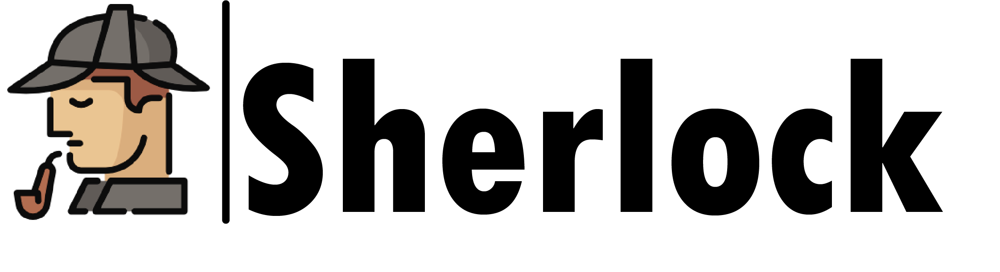
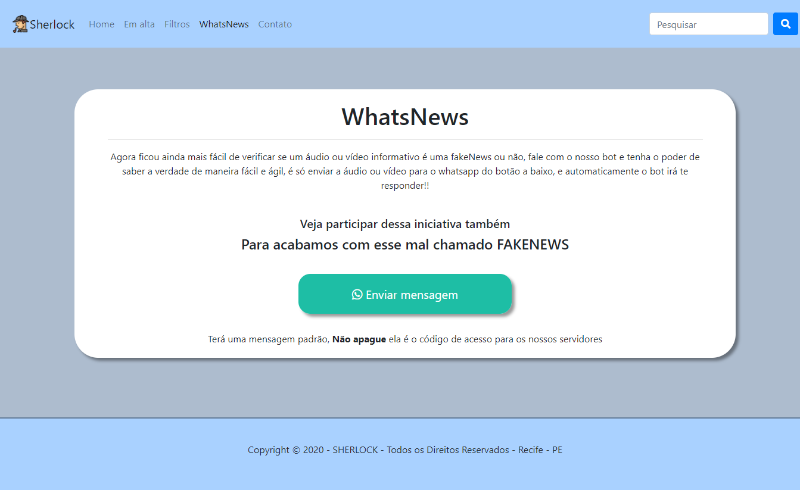

# Sherlock

O projeto utiliza as seguintes tecnologias:
<ul>
  <li>HTML</li>
  <li>CSS</li>
  <li>Jquery</li>
</ul>

Endereço da aplicação:
https://owlhost.com.br/sherlock/

# WhatsNews
Com a nossa plataforma é possível verificar se um áudio ou vídeo estão passando realmente a informação
verdadeira e não uma FAKE NEWS, na sessão WhatsNews é possível fazer essa interação com o nosso chatbot, 
é ter a confirmação da notícia com uma varredura na internet de fontes confiáveis.

